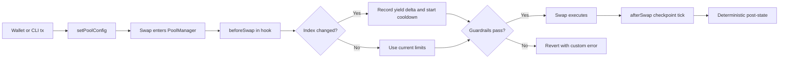
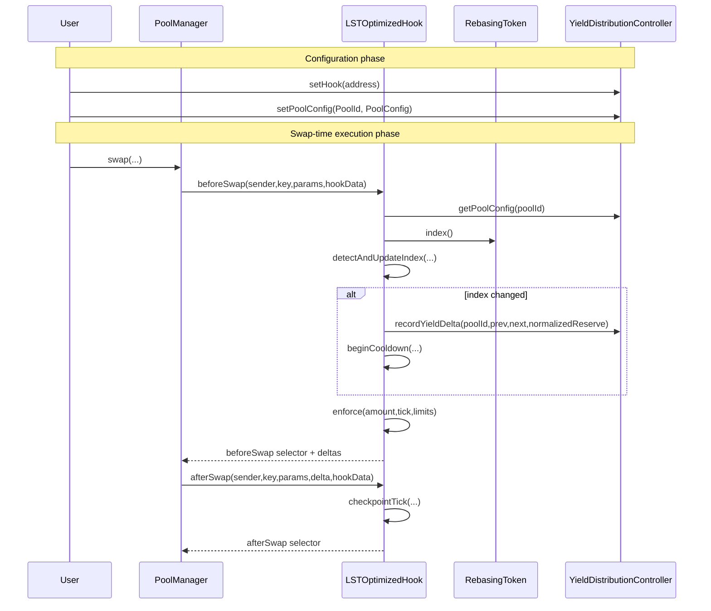
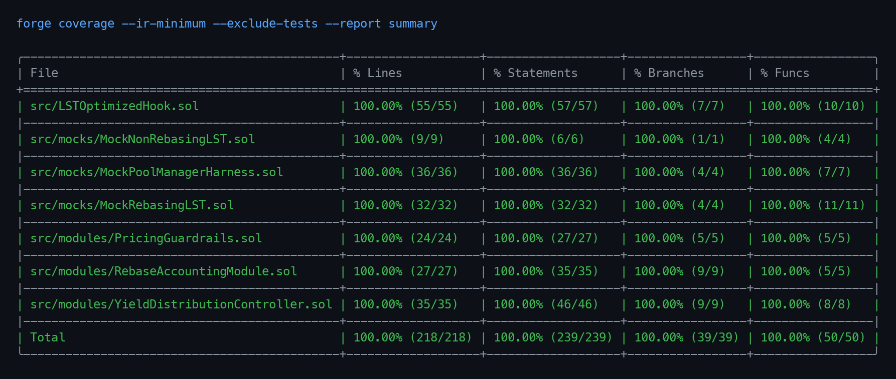

# LST-Optimized Hook Suite
**Built on Uniswap v4 · Deployed on Unichain Sepolia**

_Targeting: Uniswap Foundation Prize · Unichain Prize_

> A Uniswap v4 hook suite for LST pools that detects rebases on-chain, normalizes accounting, enforces deterministic rebase-window guardrails, and records yield deltas without keepers or off-chain automation.

[](https://github.com/Kingg-titan/lst-optimized-hook-suite/actions/workflows/test.yml)
[](#test-coverage)
[](https://docs.soliditylang.org/)
[](https://docs.uniswap.org/contracts/v4/overview)
[](https://docs.unichain.org/)

## The Problem
A concrete failure case in LST-AMM trading is a rebasing token pool where a large LP position is in-range, the token rebases upward, and a searcher executes directional flow into stale inventory assumptions immediately after the index change. The mechanism that fails is not swap execution itself, but timing around accounting state transitions: the reserve reality has moved, while the AMM path has not yet enforced a conservative execution regime. At scale, this creates measurable value transfer from passive LPs to latency-optimized flow.

The first failure layer is accounting semantics. Rebasing LSTs mutate effective value over time through an index; if pool-level logic reasons in raw token units only, normalized value drift is not explicit in policy checks. At EVM level this means the code path must read token index state and reconcile reserve normalization before making execution decisions; if it does not, value deltas become implicit and difficult to reason about under adversarial ordering.

The second failure layer is execution policy around event windows. Uniswap v3 fee tiers are static at pool creation and cannot inject pool-specific callback logic on swap-time execution, and even in v4, if a hook does not apply deterministic cooldown bounds, the pool has no native way to tighten execution immediately after rebase detection. The result is that pools remain tradable under normal limits in the exact window where risk is elevated.

The third failure layer is operational dependence. Keeper-or-bot approaches introduce liveness and race assumptions: if the operator misses a block, policy lags; if policy updates are delayed, risk remains open. At current scale (roughly $75.5B DeFi TVL and roughly $42.2B in liquid staking TVL), even small recurring leakage around rebase windows compounds into material annualized LP loss.

## The Solution
The core insight is to treat rebase detection, accounting normalization, and swap guardrails as one atomic swap-time policy path.

At operator level, a pool is configured once with the rebasing token, index delta bounds, and two deterministic regimes (normal and cooldown). Users continue to swap through standard Uniswap v4 flow; when an index change is detected on the configured token, the hook immediately records yield delta and switches to tighter limits for a bounded window. The guarantee is deterministic behavior from on-chain state only: no off-chain scheduler is required to enter or exit the guarded regime.

At EVM/Solidity level, the hook is deployed with `Hooks.BEFORE_SWAP_FLAG | Hooks.AFTER_SWAP_FLAG` permission bits, and the `PoolManager` callback path drives execution. `beforeSwap` reads `PoolConfig`, validates the configured rebasing token against `PoolKey`, checks index monotonicity and bounded delta via `RebaseAccountingModule`, optionally calls `YieldDistributionController.recordYieldDelta(...)`, and enforces amount/tick constraints via `PricingGuardrails.enforce(...)`. `afterSwap` checkpoints tick observation state. The state model is explicit: `indexState`, `guardrailState`, and cumulative accounting live in dedicated storage mappings, and unauthorized privileged writes are rejected by `onlyOwner` and `onlyHook` guards.

INVARIANT: Rebase index is monotonic and bounded by policy — verified by `RebaseAccountingModule.detectAndUpdateIndex()`

INVARIANT: Unauthorized entities cannot mutate pool config or yield accounting — verified by `YieldDistributionController.setPoolConfig()` and `YieldDistributionController.recordYieldDelta()`

INVARIANT: Oversized trades in cooldown revert under tightened limits — verified by `PricingGuardrails.enforce()`

## Architecture

### Component Overview
```text
LSTOptimizedHook
  - Uniswap v4 swap hook entrypoint; enforces rebase-aware guardrails on swap path.
RebaseAccountingModule
  - Index monotonicity, delta bounds, and normalized/raw conversion helpers.
PricingGuardrails
  - Deterministic cooldown and tick-move enforcement logic.
YieldDistributionController
  - Pool config registry and cumulative yield/distribution accounting.
MockRebasingLST
  - Deterministic index token for proving rebase behavior in tests/demo.
MockNonRebasingLST
  - Non-rebasing comparison asset for paired pool simulations.
MockPoolManagerHarness
  - Demo harness for deterministic tx-level callback proofing.
```

### Architecture Flow (Subgraphs)
```mermaid
flowchart TD
  subgraph UserOps
    U1[Operator Config Tx]
    U2[Swap Tx]
    U3[Rebase Tx]
  end

  subgraph HookSuite
    H1[LSTOptimizedHook]
    H2[RebaseAccountingModule]
    H3[PricingGuardrails]
    H4[YieldDistributionController]
  end

  subgraph UniswapV4Core
    P1[PoolManager]
    P2[PoolKey PoolId Slot0]
  end

  subgraph UnichainSepolia
    N1[MockRebasingLST index()]
    N2[MockNonRebasingLST]
  end

  U1 --> H4
  U2 --> P1
  P1 --> H1
  H1 --> H2
  H1 --> H3
  H1 --> H4
  H1 --> N1
  H1 --> P2
  U3 --> N1
  N2 --> P1
```

### User Perspective Flow


### Interaction Sequence


## Core Contracts & Components

### LSTOptimizedHook
`LSTOptimizedHook` is the policy executor for swap-time protection in LST pools. It exists as a dedicated hook so rebase detection and guardrail enforcement are coupled to `PoolManager` callbacks, not off-chain timing. This keeps policy deterministic under adversarial ordering.

Its critical externally reachable path is the Uniswap v4 callback surface implemented through `BaseHook`: `function beforeSwap(address, PoolKey calldata, SwapParams calldata, bytes calldata) external returns (bytes4, BeforeSwapDelta, uint24)` and `function afterSwap(address, PoolKey calldata, SwapParams calldata, BalanceDelta, bytes calldata) external returns (bytes4, int128)`. It also exposes `function getHookPermissions() public pure returns (Hooks.Permissions memory)` and `function getGuardrailState(PoolId poolId) external view returns (PricingGuardrails.GuardrailState memory)`.

The hook owns `mapping(PoolId => RebaseAccountingModule.PoolIndexState) public indexState`, `mapping(PoolId => PricingGuardrails.GuardrailState) private guardrailState`, and `mapping(PoolId => uint256) public constrainedSwapCount`. These variables are the full runtime model of detected index transitions, regime windows, and constrained-execution counters.

Its trust boundary is strict: the callback entrypoints are only callable through the `PoolManager` path inherited from `BaseHook`; unauthorized direct caller attempts fail the base-hook caller validation. Configuration authority is delegated to `YieldDistributionController`, and a pool with no enabled config reverts with `PoolNotConfigured()`.

In call-stack terms, `LSTOptimizedHook` sits between Uniswap v4 core and policy modules. Upstream, `PoolManager` invokes it on swap lifecycle events; downstream, it calls `IRebasingIndexToken.index()`, `IERC20.balanceOf(poolManager)`, `YieldDistributionController.getPoolConfig(...)`, `YieldDistributionController.recordYieldDelta(...)`, and internal libraries for accounting and guardrails.

### YieldDistributionController
`YieldDistributionController` is the authoritative registry for pool-level policy and cumulative yield accounting. It is separated from the hook so governance/control-plane concerns are isolated from hot-path swap callbacks.

Critical functions are `function setHook(address nextHook) external`, `function setPoolConfig(PoolId poolId, PoolConfig calldata config) external`, `function getPoolConfig(PoolId poolId) external view returns (PoolConfig memory)`, `function getPoolAccounting(PoolId poolId) external view returns (PoolAccounting memory)`, and `function recordYieldDelta(PoolId poolId, uint256 previousIndex, uint256 nextIndex, uint256 normalizedReserve) external returns (uint256 yieldDeltaRaw, uint256 distributedRaw)`.

State ownership is explicit: `address public immutable owner`, `address public hook`, `mapping(bytes32 => PoolConfig) private poolConfigs`, and `mapping(bytes32 => PoolAccounting) private poolAccounting`. `PoolConfig` stores all guardrail and distribution parameters; `PoolAccounting` tracks last and cumulative yield metrics.

Its trust boundary is enforced by `onlyOwner` on control-plane writes and `onlyHook` on yield-delta recording. Unauthorized callers revert with `Unauthorized()`. Invalid config combinations revert with `InvalidConfig()` before storage mutation, preventing unsafe runtime settings.

In stack terms, it receives configuration from the operator and receives accounting writes from the hook. It does not call `PoolManager`; it is intentionally one layer below policy execution and one layer above storage/state introspection.

### RebaseAccountingModule
`RebaseAccountingModule` is a pure/storage-linked library that standardizes index and normalization behavior across the system. It exists independently so math, rounding, and index-state transitions are reusable and auditable without hook-side side effects.

Critical functions are `function normalizeDown(uint256 rawAmount, uint256 index_) internal pure returns (uint256)`, `function normalizeUp(uint256 rawAmount, uint256 index_) internal pure returns (uint256)`, `function denormalizeDown(uint256 normalizedAmount, uint256 index_) internal pure returns (uint256)`, `function denormalizeUp(uint256 normalizedAmount, uint256 index_) internal pure returns (uint256)`, and `function detectAndUpdateIndex(PoolIndexState storage state, uint256 nextIndex, uint256 maxDeltaBps) internal returns (bool changed, uint256 previousIndex, uint256 deltaBps)`.

It owns no standalone contract storage, but it defines `PoolIndexState { uint256 lastIndex; uint40 lastIndexUpdate; }`, which is embedded in hook storage via `indexState`. This is the only stateful part of the module, and it is written only through the hook path.

Its trust boundary is inherited from callers. In this project it is called from hook logic only; malformed values are rejected through `InvalidIndex()`, `IndexMustBeMonotonic(...)`, and `IndexDeltaTooLarge(...)`, which halt execution before unsafe state updates.

In stack terms, it sits below `LSTOptimizedHook` and above no contracts. It transforms raw reserve/index data into deterministic normalized values and enforces monotonic-index guarantees consumed by downstream yield accounting.

### PricingGuardrails
`PricingGuardrails` is the deterministic execution-policy library that controls swap amount and tick movement under normal and cooldown regimes. It exists as a separate module so policy evolution can remain isolated from callback orchestration.

Critical functions are `function beginCooldown(GuardrailState storage state, GuardrailConfig memory cfg, uint40 timestamp) internal`, `function inCooldown(GuardrailState memory state, uint40 timestamp) internal pure returns (bool)`, `function currentLimits(GuardrailConfig memory cfg, GuardrailState memory state, uint40 timestamp) internal pure returns (uint256 maxAmountIn, uint16 maxImpactBps)`, `function enforce(GuardrailConfig memory cfg, GuardrailState memory state, uint40 timestamp, uint256 amountIn, int24 currentTick) internal pure returns (bool constrained)`, and `function checkpointTick(GuardrailState storage state, int24 tick_, uint40 timestamp) internal`.

Storage is represented through `GuardrailState { uint40 cooldownEnd; uint40 hysteresisEnd; int24 lastObservedTick; uint40 lastObservedAt; }` in hook mapping `guardrailState`. Runtime config arrives from controller through `PoolConfig` fields mapped into `GuardrailConfig`.

Its trust boundary is indirect: only hook code can mutate guardrail state. Constraint violations revert with `SwapAmountExceedsLimit(...)` or `TickMoveExceedsLimit(...)`, guaranteeing immediate swap-path rejection when limits are exceeded.

In stack terms, it is called from `LSTOptimizedHook` before and after swap callbacks. It neither reads external contracts nor writes external state, making it deterministic and bounded-gas for callback safety.

### MockRebasingLST
`MockRebasingLST` is the deterministic test/demonstration token model for stETH-like index behavior. It is a dedicated module so rebase semantics are explicit in tests and testnet proof flows without depending on third-party LST contracts.

Critical functions are `function index() external view returns (uint256)`, `function mint(address to, uint256 amount) external`, `function rebaseByBps(uint16 deltaBps) external`, and `function setIndex(uint256 nextIndex) external`. It also exposes compatibility helpers (`totalShares`, `sharesOf`, and previews) for index-oriented integrations.

State ownership includes `address public immutable owner`, `uint256 public immutable maxRebaseDeltaBps`, and `uint256 private _index`. All mutating entrypoints are owner-gated through `onlyOwner`, and invalid updates revert with `InvalidIndex()` or `RebaseTooLarge(...)`.

Its trust boundary is explicit and narrow. It is trusted as the index source in configured pools; unauthorized callers cannot mint or rebase. In production deployments this boundary would be replaced by a live LST contract with independent trust assumptions.

In call-stack terms, the hook reads `index()` and reserve balances from this token, and demo scripts call `rebaseByBps(...)` to force deterministic rebase-window proofs.

### Data Flow
The primary flow starts when the operator calls `YieldDistributionController.setPoolConfig(PoolId, PoolConfig)` and `setHook(address)` to set the policy envelope. On swap, `PoolManager` triggers `LSTOptimizedHook.beforeSwap(...)`; the hook computes `poolId`, reads config via `getPoolConfig`, validates token placement with `_validateConfiguredToken`, and reads the live index through `IRebasingIndexToken.index()`.

The hook then calls `RebaseAccountingModule.detectAndUpdateIndex(...)`, which writes `indexState[poolId].lastIndex` and `lastIndexUpdate` when needed. If a rebase is detected, it reads raw reserve with `IERC20.balanceOf(poolManager)`, computes normalized reserve via `normalizeDown(...)`, and calls `YieldDistributionController.recordYieldDelta(...)`, which writes `poolAccounting[poolId].lastYieldDeltaRaw`, `cumulativeYieldRaw`, `cumulativeDistributedRaw`, and `lastObservedIndex`.

After accounting writes, `PricingGuardrails.beginCooldown(...)` updates `guardrailState[poolId].cooldownEnd` and `hysteresisEnd`, and `PricingGuardrails.enforce(...)` checks amount and tick bounds. If constrained, `constrainedSwapCount[poolId]` increments. Control returns to `PoolManager`, swap execution proceeds, and on callback `afterSwap(...)` writes `guardrailState[poolId].lastObservedTick` and `lastObservedAt` via `checkpointTick(...)`.

## Guardrail Regimes

| Regime | Entry Condition | Active Limits | Swap-Time Effect |
|---|---|---|---|
| Normal | No active cooldown (`block.timestamp >= cooldownEnd`) | `maxAmountIn`, `maxImpactBps` | Standard configured execution bounds |
| Cooldown | Rebase detected and `block.timestamp < cooldownEnd` | `cooldownMaxAmountIn`, `cooldownMaxImpactBps` | Tighter bounds; oversized or jumpy swaps revert |
| Hysteresis window | `cooldownEnd <= block.timestamp < hysteresisEnd` | Normal limits, but recent tick checkpoints preserved | Prevents immediate state-flip ambiguity after cooldown |

The non-obvious behavior is that regime selection is purely timestamp/state based at callback time, so enforcement is deterministic and does not depend on keeper intervention.

## Deployed Contracts

### Unichain Sepolia (chainId 1301)

| Contract | Address |
|---|---|
| YieldDistributionController | [0xBdb3472D1D3eF34662e44c3142EfC0366877ca7f](https://sepolia.uniscan.xyz/address/0xBdb3472D1D3eF34662e44c3142EfC0366877ca7f) |
| LSTOptimizedHook | [0xd6DF2976E510312F782C91146c0387d6085880c0](https://sepolia.uniscan.xyz/address/0xd6DF2976E510312F782C91146c0387d6085880c0) |
| MockRebasingLST | [0x6744af6f637887495E261Ec0f14c9bF9F10cA1B9](https://sepolia.uniscan.xyz/address/0x6744af6f637887495E261Ec0f14c9bF9F10cA1B9) |
| MockNonRebasingLST | [0x5793351da4b69071fe012213fb1e9f7465C519F9](https://sepolia.uniscan.xyz/address/0x5793351da4b69071fe012213fb1e9f7465C519F9) |
| Uniswap v4 PoolManager (external infra) | [0x00b036b58a818b1bc34d502d3fe730db729e62ac](https://sepolia.uniscan.xyz/address/0x00b036b58a818b1bc34d502d3fe730db729e62ac) |

## Live Demo Evidence
Demo run date: March 16, 2026.

### Phase 1 — Pool Configuration (Unichain Sepolia)
This phase proves that pool policy is written on-chain before lifecycle execution starts. The operator executes configuration logic that calls `YieldDistributionController.setPoolConfig(...)` on the deployed controller and emits `PoolConfigUpdated` with the poolId and guardrail values. A verifier should inspect the call input and emitted event fields to confirm cooldown and impact bounds are set as expected: [0x63a8766d16db5bc4cffd0e3660c122cab284a6f65fbdc54265da623723059809](https://sepolia.uniscan.xyz/tx/0x63a8766d16db5bc4cffd0e3660c122cab284a6f65fbdc54265da623723059809). This phase proves control-plane policy is deterministic and on-chain.

### Phase 2 — User Rebase Trigger (Unichain Sepolia)
This phase proves index mutation is externally visible and auditable before guarded swap flow. The user signs and sends `MockRebasingLST.rebaseByBps(uint16)`; the token updates `_index` and emits `Rebased(previousIndex,nextIndex)`. A verifier should inspect the event payload and confirm index growth under owner-gated control: [0x843b5964ea643c28911ec39878c2afcddc0c791e10cf52bbcf2229590fedd439](https://sepolia.uniscan.xyz/tx/0x843b5964ea643c28911ec39878c2afcddc0c791e10cf52bbcf2229590fedd439). This phase proves the index input that drives guardrail regime transitions is real transaction state, not simulation-only state.

### Phase 3 — Normal Swap Path (Unichain Sepolia)
This phase proves swaps pass with baseline limits when no fresh rebase transition is being applied. The lifecycle harness calls `MockPoolManagerHarness.callBeforeSwap(...)`, which triggers hook `beforeSwap` and emits `GuardrailCheck(..., constrained=false, ...)`; then `callAfterSwap(...)` triggers hook checkpointing of tick via `afterSwap`. A verifier should inspect both traces and logs to confirm successful before/after callback flow: [0x73ca191ad7c59e800e795069f6a8ac4da29ddc5c76f9144aa3313a7309af4829](https://sepolia.uniscan.xyz/tx/0x73ca191ad7c59e800e795069f6a8ac4da29ddc5c76f9144aa3313a7309af4829) and [0x31c8a65438a65e85db96f54ccdd0062654e9bdfcee1e55534f9006010890d4d8](https://sepolia.uniscan.xyz/tx/0x31c8a65438a65e85db96f54ccdd0062654e9bdfcee1e55534f9006010890d4d8). This phase proves baseline execution path integrity.

### Phase 4 — Rebase Detection and Constrained Swap (Unichain Sepolia)
This phase proves the hook transitions regimes and records yield accounting in the same deterministic callback path. The harness first sends a token rebase tx (`rebaseByBps`) and then calls `callBeforeSwap(...)`; inside hook `beforeSwap`, index transition is detected, `recordYieldDelta(...)` is called, `RebaseDetected` is emitted, and constrained limits are activated. A verifier should inspect the rebase tx and then inspect the subsequent beforeSwap tx for `YieldRecorded`, `RebaseDetected`, and `GuardrailCheck(constrained=true)`: [0x2b9c85bd974460d29c940dd4a8422a683a295ce39ddecf486892b8332a58e70b](https://sepolia.uniscan.xyz/tx/0x2b9c85bd974460d29c940dd4a8422a683a295ce39ddecf486892b8332a58e70b), [0x926c8d09732a9ddd1aadb8e2be678efdae0360763439398dca73a43ecf3310d9](https://sepolia.uniscan.xyz/tx/0x926c8d09732a9ddd1aadb8e2be678efdae0360763439398dca73a43ecf3310d9), and the paired afterSwap checkpoint tx [0xb71c6e9bddb00b685f4ac5af6841e12752db707d88fd01173a754ff078a8251a](https://sepolia.uniscan.xyz/tx/0xb71c6e9bddb00b685f4ac5af6841e12752db707d88fd01173a754ff078a8251a). This phase proves rebase accounting and guarded execution are atomically coupled.

### Phase 5 — Oversized Cooldown Swap Blocked (Unichain Sepolia)
This phase proves conservative enforcement in cooldown windows. The harness calls `callBeforeSwap(...)` with an amount above `cooldownMaxAmountIn`; the hook path rejects under `PricingGuardrails.enforce(...)`, and the harness emits `BeforeSwapInvoked` with revert-encoded data. A verifier should inspect the tx logs and confirm blocked-path evidence under a successful outer harness tx: [0xf6fa19279c2c60168c345097e8328186a9061323499899a016bb8950ba945a00](https://sepolia.uniscan.xyz/tx/0xf6fa19279c2c60168c345097e8328186a9061323499899a016bb8950ba945a00). This phase proves toxic oversized flow is rejected deterministically during cooldown.

### Phase 6 — Post-Cooldown Swap Allowed (Unichain Sepolia)
This phase proves execution returns to normal policy after cooldown progression. The harness advances deterministic filler state and then calls `callBeforeSwap(...)` with a larger notional that should pass normal limits; the subsequent `callAfterSwap(...)` confirms full callback completion. A verifier should inspect that both before and after paths succeed and that no cooldown-limit revert appears: [0xd9f06a2bb31187f58ab8800c59586d2098124f807455deb8d031c24a61f8d1bc](https://sepolia.uniscan.xyz/tx/0xd9f06a2bb31187f58ab8800c59586d2098124f807455deb8d031c24a61f8d1bc) and [0x0aed320f15b5826b8cb8cad002d695fc8fb63f07780fbe8b01c9d798cc4dbd9d](https://sepolia.uniscan.xyz/tx/0x0aed320f15b5826b8cb8cad002d695fc8fb63f07780fbe8b01c9d798cc4dbd9d). This phase proves bounded re-entry to normal trading conditions.

Taken together, these phases form a full on-chain proof chain: policy configuration, index mutation, guarded callback execution, constrained rejection, cooldown expiry, and resumed execution are all independently verifiable from transaction traces and emitted events.

## Running The Demo
```bash
# full pipeline: bootstrap, build, tests, local+rebase+testnet demos
make demo-all
```

```bash
# public testnet lifecycle proof with tx links and phase logs
make demo-testnet
# focused rebase/cooldown proof test
make demo-rebase
```

```bash
# local deterministic lifecycle proof test
make demo-local
# direct Foundry lifecycle summary test
forge test --match-test testDemoLifecycleSummary -vv
```

## Test Coverage
```text
Lines:      100.00%
Statements: 100.00%
Branches:   100.00%
Functions:  100.00%
```



```bash
# run full test suite
forge test -vvv
# generate/update lcov coverage artifact
forge coverage --report lcov --report-file coverage/lcov.info --ir-minimum --exclude-tests
# print aggregate coverage stats from lcov artifact
awk 'BEGIN{FS=":"} /^LF:/{lf+=$2} /^LH:/{lh+=$2} /^BRF:/{brf+=$2} /^BRH:/{brh+=$2} /^FNF:/{fnf+=$2} /^FNH:/{fnh+=$2} END{printf("functions %.2f%%\\nbranches %.2f%%\\nlines %.2f%%\\n",100*fnh/fnf,100*brh/brf,100*lh/lf)}' coverage/lcov.info
```

- `Unit`: math, config validation, access control, and event behavior.
- `Edge`: boundary windows, max amount/tick boundaries, extreme index deltas.
- `Fuzz`: round-trip conversions, monotonic index assumptions, valid-input non-reverts.
- `Integration`: end-to-end swap lifecycle with deterministic rebase stress windows.

## Repository Structure
```text
.
├── src/
│   ├── LSTOptimizedHook.sol
│   ├── modules/
│   ├── mocks/
│   └── interfaces/
├── scripts/
│   ├── bootstrap.sh
│   ├── demo_testnet.sh
│   ├── demo_local.sh
│   ├── demo_rebase.sh
│   └── export_abis.sh
├── test/
│   ├── LSTOptimizedHook.t.sol
│   ├── RebaseAccountingModule.t.sol
│   ├── YieldDistributionController.t.sol
│   ├── PricingGuardrails.t.sol
│   ├── MockLSTs.t.sol
│   └── DemoFlow.t.sol
└── docs/
    ├── overview.md
    ├── architecture.md
    ├── lst-models.md
    ├── rebase-accounting.md
    ├── guardrails.md
    ├── security.md
    ├── deployment.md
    ├── demo.md
    ├── api.md
    └── testing.md
```

## Documentation Index

| Doc | Description |
|---|---|
| `docs/overview.md` | High-level system objective and scope. |
| `docs/architecture.md` | Component relationships and execution boundaries. |
| `docs/lst-models.md` | Rebasing vs non-rebasing token assumptions. |
| `docs/rebase-accounting.md` | Normalization math, units, and rounding behavior. |
| `docs/guardrails.md` | Cooldown and impact-bound regime logic. |
| `docs/security.md` | Threat model, mitigations, and residual risks. |
| `docs/deployment.md` | Local/testnet deployment flow and addresses. |
| `docs/demo.md` | Judge-oriented phase-by-phase demonstration steps. |
| `docs/api.md` | Public and operational contract API surface. |
| `docs/testing.md` | Test scope, commands, and assurance intent. |

## Key Design Decisions
**Why split policy storage from hook execution?**  
`YieldDistributionController` holds config and cumulative accounting while `LSTOptimizedHook` stays focused on callback-time policy. This avoids overloading the hook with governance and allows explicit owner/hook trust boundaries. The alternative (single contract) increases blast radius for both execution and control-plane bugs.

**Why detect rebases during swap callbacks instead of keepers?**  
Swap-time detection guarantees policy transition in the exact path where execution risk exists. This removes liveness assumptions and scheduling races introduced by off-chain automation. A keeper-based design was rejected because it cannot guarantee bounded latency under congestion.

**Why normalize reserves with downward rounding?**  
`normalizeDown` is used in yield delta derivation to avoid synthetic value creation from rounding up in adversarial sequences. This is a conservative accounting policy that biases toward safety for LP accounting interpretations. The alternative (always rounding up) can overstate derived deltas.

**Why isolate guardrail math in a library?**  
`PricingGuardrails` remains deterministic and side-effect-light, which makes it easier to test boundary behavior and keep hook bytecode simpler. Embedding all branch logic directly in hook code would reduce clarity and complicate differential review of policy changes.

## Roadmap
- [ ] Add optional payout vault to settle `cumulativeDistributedRaw` on-chain.
- [ ] Add multi-pool batch configuration tooling with timelock ownership model.
- [ ] Extend guardrail model with volatility-adaptive bounded windows.
- [ ] Add invariant/property test harness for cross-pool conservation checks.
- [ ] Add formal spec assertions for hook callback ordering guarantees.

## License
MIT
