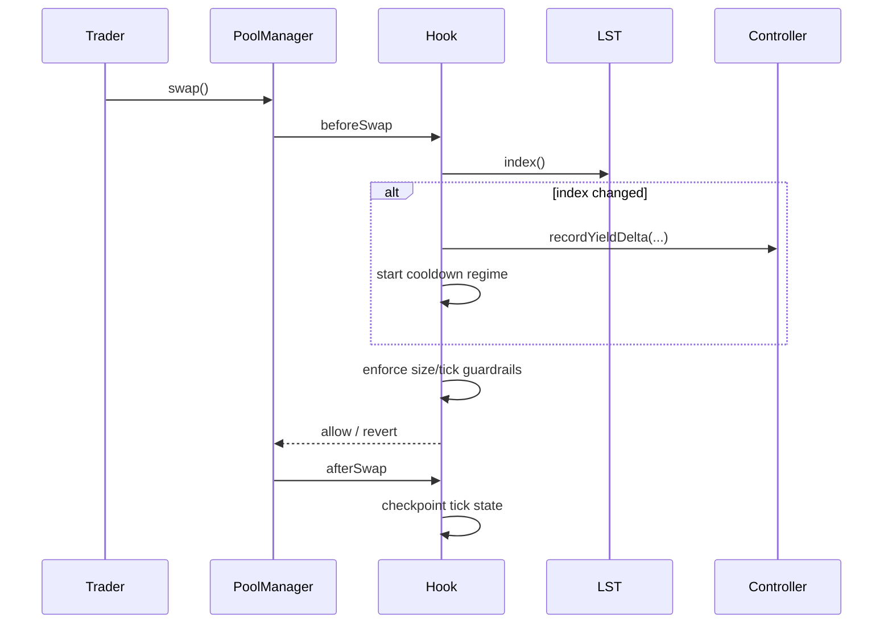
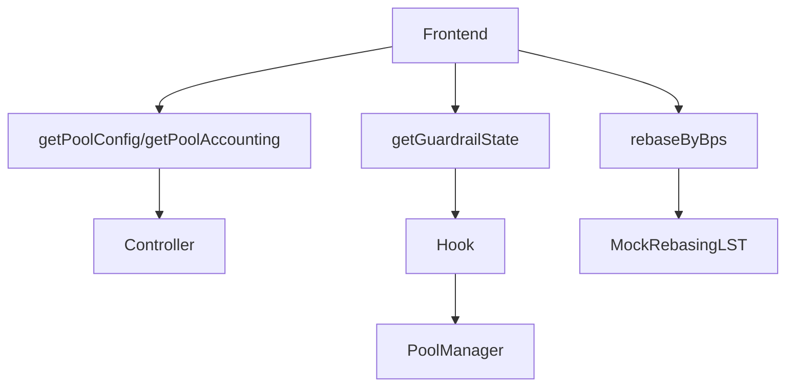

# LST-Optimized Hook Suite


Uniswap v4 specialized-market hook suite for **rebasing-aware LST pools**.

The suite provides deterministic behavior for:
- rebasing-aware accounting (normalized units)
- bounded yield distribution accounting (neutral or split)
- deterministic swap guardrails around rebase windows

It does this **without keepers/bots/reactive automation**.

## Problem
LST pools can be unfair around index updates (rebases): balances or exchange assumptions change while users submit swaps under stale execution expectations.

## Solution
`LSTOptimizedHook` enforces deterministic guardrails and accounting during swap lifecycle callbacks:
- detects index changes from rebasing token interface
- enters cooldown regime with stricter constraints
- maintains normalized accounting views and deterministic yield deltas
- exposes explicit state for dashboards and demos

## Repository Layout
- `src/` contracts and modules
- `test/` unit, edge, fuzz, integration-style tests
- `script/` Foundry deployment/config scripts
- `scripts/` bootstrap/demo/utility shell scripts
- `frontend/` LST Pool Console
- `shared/` shared ABIs and frontend types
- `docs/` architecture, security, demo and API docs
- `context/` source-of-truth docs references (`context/unchain`)

## Architecture
```mermaid
flowchart LR
  UI[Frontend Console] --> Controller[YieldDistributionController]
  UI --> Hook[LSTOptimizedHook]
  Hook --> PM[Uniswap v4 PoolManager]
  Hook --> RAM[RebaseAccountingModule]
  Hook --> PG[PricingGuardrails]
  Hook --> LST[MockRebasingLST/index()]
  Hook --> Controller
```





## Hook Permissions
Per Uniswap v4 core docs, hook permissions are encoded in hook address bits and validated in constructor. This suite enables:
- `beforeSwap`
- `afterSwap`

Security invariant: only `PoolManager` can call hook entrypoints (`BaseHook.onlyPoolManager`).

## Core Contracts
- `src/LSTOptimizedHook.sol`
- `src/modules/RebaseAccountingModule.sol`
- `src/modules/PricingGuardrails.sol`
- `src/modules/YieldDistributionController.sol`
- `src/mocks/MockRebasingLST.sol` (demo-only)
- `src/mocks/MockNonRebasingLST.sol` (comparison model)

## Deterministic Dependency Pinning
Uniswap v4 dependency pin is enforced by `scripts/bootstrap.sh`:
- v4-periphery pinned to commit `3779387`
- v4-core pinned to the exact submodule commit referenced by that periphery commit

Run:
```bash
make bootstrap
```

## Setup
```bash
make bootstrap
forge build
forge test
```

Export shared ABIs:
```bash
make export-abis
```

## Demo
Local deterministic demo:
```bash
make demo-local
make demo-rebase
```

Testnet deploy (Base Sepolia preferred):
```bash
cp .env.example .env
# set PRIVATE_KEY + RPC_URL_BASE_SEPOLIA
make demo-testnet
```

Expected demo summary includes:
- index before/after
- constrained swap count in cooldown
- yield delta and distributed amount from controller accounting

Explorer links are chain dependent:
- Base Sepolia: `https://sepolia.basescan.org/tx/<hash>`
- unknown chain: `TBD` + raw tx hash output

## Deployment Addresses
- Local anvil: produced per run (`script/10_DeployLSTSuite.s.sol` output)
- Base Sepolia: TBD until broadcast in your environment

## Testing
- Unit tests: accounting + guardrail modules
- Edge tests: cooldown boundaries, max swap, extreme index delta, unauthorized config
- Fuzz tests: round-trip conversions and guardrail-valid input ranges
- Integration-style tests: swap lifecycle with pool manager and hook callbacks

Run coverage:
```bash
make coverage
```

## Docs Index
- [Overview](docs/overview.md)
- [Architecture](docs/architecture.md)
- [LST Models](docs/lst-models.md)
- [Rebase Accounting](docs/rebase-accounting.md)
- [Guardrails](docs/guardrails.md)
- [Security](docs/security.md)
- [Deployment](docs/deployment.md)
- [Demo](docs/demo.md)
- [API](docs/api.md)
- [Testing](docs/testing.md)
- [Frontend](docs/frontend.md)

## Assumptions
- `MockRebasingLST` is a demo token exposing deterministic `index()` behavior and bounded rebase changes.
- LST token interface honesty is part of trust model.
- Guardrails reduce but do not eliminate all MEV opportunities.

## License
MIT (see `LICENSE`).
