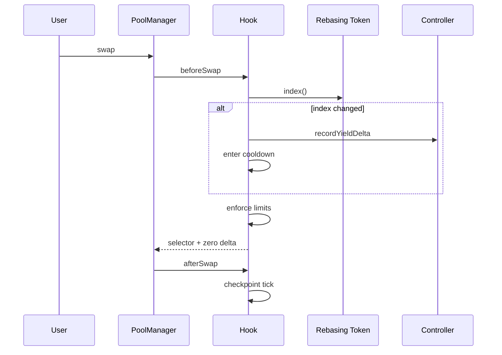

# LST-Optimized Hook Suite Spec

## Objective
Deliver a Uniswap v4 specialized-market hook system for LST pools that provides deterministic rebase-aware execution and accounting without external automation.

## Scope
Implemented components:
- `LSTOptimizedHook` (core swap hooks)
- `RebaseAccountingModule` (normalized conversions + index bounds)
- `YieldDistributionController` (pool config + O(1) yield accounting)
- `PricingGuardrails` (cooldown + size/tick constraints)
- `MockRebasingLST` and `MockNonRebasingLST` for demo/testing
- Foundry tests, deploy scripts, and frontend console

## Design Goals
- deterministic state transitions at swap time
- strict hook caller model (`onlyPoolManager`)
- deterministic bounded gas; no LP iteration
- explicit trust model and residual-risk documentation

## System Diagram
```mermaid
flowchart LR
  subgraph Core
    H[LSTOptimizedHook]
    R[RebaseAccountingModule]
    G[PricingGuardrails]
    C[YieldDistributionController]
  end
  PM[PoolManager] <--> H
  H --> R
  H --> G
  H --> C
  LST[Rebasing Token index()] --> H
  UI[Frontend] --> C
  UI --> H
```

## Lifecycle


## Deterministic Math
- Unit model: WAD (`1e18`) for index and normalized conversions
- Rounding:
  - normalize down by default to avoid synthetic value creation
  - explicit up/down conversion helpers in `RebaseAccountingModule`
- Yield estimate:
  - `yieldDeltaRaw = normalizedReserve * (nextIndex - prevIndex) / 1e18`

## Guardrail Regimes
- Normal: `maxAmountIn`, `maxImpactBps`
- Cooldown (triggered on index change): `cooldownMaxAmountIn`, `cooldownMaxImpactBps`
- Optional hysteresis interval retained in runtime state for extension

## Security Invariants
- only `PoolManager` can trigger hook entrypoints
- pool config writes limited to controller owner
- index monotonicity and max delta checks enforced
- cooldown guardrails bounded and deterministic

## Dependency Reproducibility
- `scripts/bootstrap.sh` sets and verifies:
  - v4-periphery commit `3779387`
  - matching v4-core commit from periphery tree

## Non-Goals
- full MEV elimination
- off-chain keeper orchestration
- dynamic oracle dependency for guardrails
